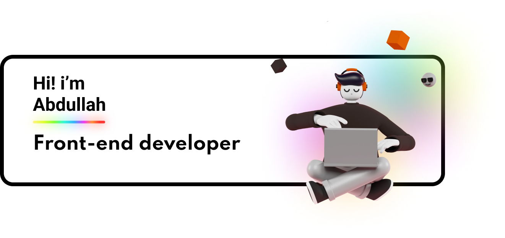

## 📝 Latest Blog Posts

 

<!-- BLOG-POST-LIST:START -->
- [5 Basic Tips for Angular Unit Testing](https://braydoncoyer.dev/blog/5-basic-tips-for-angular-unit-testing)
- [Learn How to Click a Button when Angular Unit Testing](https://braydoncoyer.dev/blog/learn-how-to-click-a-button-when-angular-unit-testing)
- [Enable Autocomplete for Tailwind CSS in VSCode](https://braydoncoyer.dev/blog/enable-autocomplete-for-tailwind-css-in-vscode)
- [What Makes a Unit Test Valuable?](https://braydoncoyer.dev/blog/what-makes-a-unit-test-valuable)
- [You Don&#39;t Need a CS Degree to Land a Web Development Job](https://braydoncoyer.dev/blog/you-don't-need-a-cs-degree-to-land-a-web-development-job)
<!-- BLOG-POST-LIST:END -->

 

## 💼 Skills

<!--
**devdezzies/devdezzies** is a ✨ _special_ ✨ repository because its `README.md` (this file) appears on your GitHub profile.

Here are some ideas to get you started:

- 🔭 I’m currently working on ...
- 🌱 I’m currently learning ...
- 👯 I’m looking to collaborate on ...
- 🤔 I’m looking for help with ...
- 💬 Ask me about ...
- 📫 How to reach me: ...
- 😄 Pronouns: ...
- ⚡ Fun fact: ...
-->
